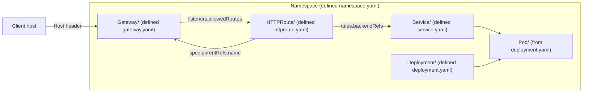
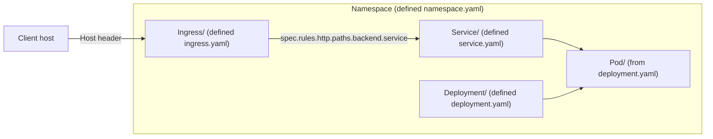
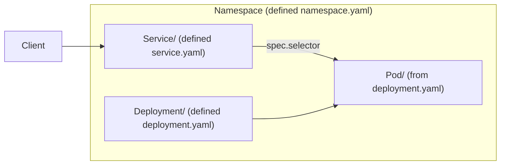

# K8s Network Mermaid

1. Resolve target directory:
- If user gives an app root (for example `apps/nginx`) and manifests are not directly there, check common subdirs like `base/` and use the manifest directory you find.
- Do not assume Gateway API files exist; inspect actual files first.
2. Read manifests in this priority: `namespace.yaml`, `deployment.yaml`, `service.yaml`, `gateway.yaml`, `httproute.yaml`, `ingress.yaml`.
3. Choose the best flow that matches existing resources:
- Gateway API flow (preferred when both exist): `Client -> Gateway -> HTTPRoute -> Service -> Pod`
- Ingress flow (when `ingress.yaml` exists): `Client -> Ingress -> Service -> Pod`
- Service-only flow (when ingress/gateway resources are absent): `Client -> Service -> Pod` (and show Deployment -> Pod)
4. Label each node as `Kind/name (defined <file>.yaml)`.
5. Represent namespace boundaries with `subgraph`.
6. Keep Mermaid parser-safe:
- Use quoted labels (`["..."]`)
- End statements with `;`
- Avoid HTML tags (such as ` `) and overly complex edge labels
7. Save `.mmd` next to the manifests unless the user requests another path.
8. If parse errors occur, simplify labels and punctuation first.
9. If expected files are missing, explicitly mention which files were absent and that the diagram was adapted to actual manifests.

## Templates

### Gateway API

### Ingress

### Service-only

## Output Rules

- Keep diagrams minimal and directly traceable to current YAML.
- Prefer one `.mmd` file per app directory.
- If requested, also embed the same Mermaid block into README.
- Prefer file name `architecture.mmd` unless user requests another name.
